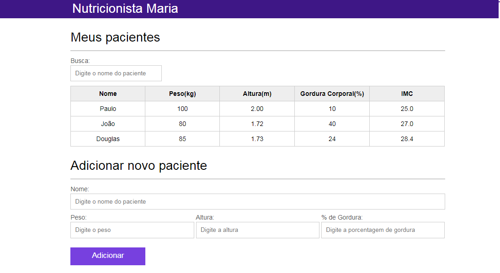

# Controle de Pacientes

### Projeto "Controle de dados de pacientes para nutricionistas" desenvolvido para o curso de *JavaScript: Programando na linguagem da web* do instrutor Douglas Quintanilha. 

&nbsp;

O site *Nutricionista Maria* possibilita armazenar as seguintes informações do paciente, que são exibidas numa tabela: 

* nome;

* peso; 

* altura;

* gordura corporal;

* IMC (Índice de Massa Corpórea).

&nbsp;

É possível adicionar novos cadastros dinamicamente, filtrar os nomes dos pacientes, remover os pacientes e o cálculo do IMC será realizado pelo sistema.

&nbsp;

Clique na imagem para visualizar o site:

